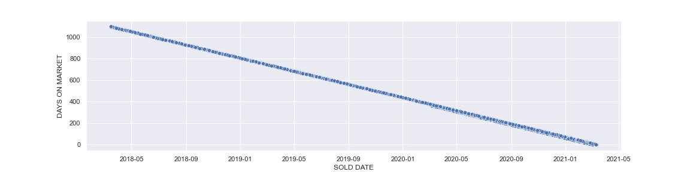
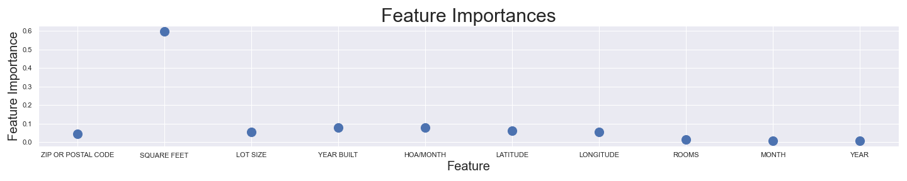
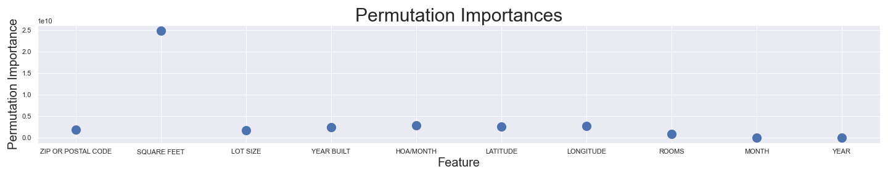
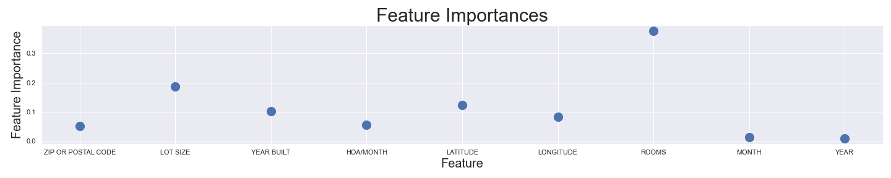
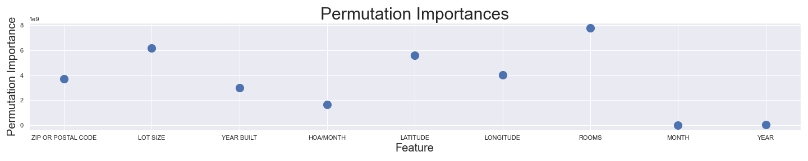
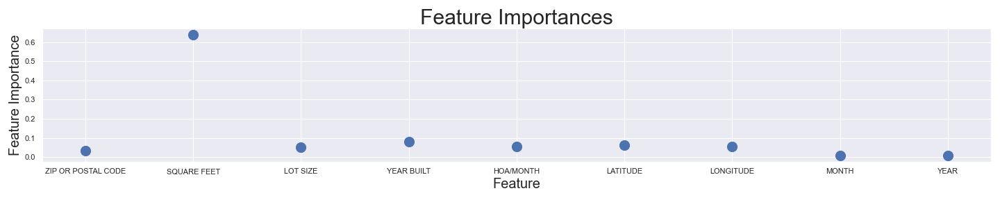
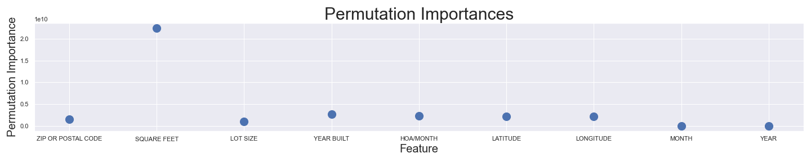

# Predicting Home Values in San Antonio, TX

### Background

Predicting home values is a difficult process.  A home value is really based on what someone will pay for the house which makes things difficult.  People are different and often have different tastes, opinions, and priorities as well as different budgets, risk tolerances, and financial goals.  Local tax jurisdictions assess the value of homes but those values do not often line up with what the homes sell for.  With all of this in mind, we see that predicting a home value is an imperfect process.

However, there are numerous services out there that can get pretty close.  Zillow has a "Zestimate" prediction which boasts a high accuracy of predicted value versus sale price.  According to their website (https://www.zillow.com/z/zestimate/), they have a median error of 1.6% and 87.9% of homes sold have a Zestimate within 5% of the final sale price.  Redfin and Realtor.com also have their own ways of predicting home values.  

This project will use various machine learning techniques to attempt to come up with a home value estimator that is comparable to these services.  Because of the time constraint, it will not be able to be used on current for-sale houses, but it will be used on past data to compare predictions to actual sale prices. 

### The Data

The data was compiled from redfin.com.  It includes sold houses in the San Antonio metro area as well as some surrounding neighborhoods.  It includes 3 years of sold house data.  

#### Features

The features that are automatically pulled when downloading data from redfin are:
1.   SALE TYPE                                                                                   
2.   SOLD DATE                                                                                   
3.   PROPERTY TYPE                                                                               
4.   ADDRESS                                                                                     
5.   CITY                                                                                        
6.   STATE OR PROVINCE                                                                           
7.   ZIP OR POSTAL CODE                                                                          
8.   PRICE                                                                                       
9.   BEDS                                                                                        
10.   BATHS                                                                                       
11.  LOCATION                                                                                    
12.  SQUARE FEET                                                                                 
13.  LOT SIZE                                                                                    
14.  YEAR BUILT                                                                                  
15.  DAYS ON MARKET                                                                              
16.  USD/SQUARE FEET                                                                               
17.  HOA/MONTH                                                                                   
18.  STATUS                                                                                      
19.  NEXT OPEN HOUSE START TIME                                                                  
20.  NEXT OPEN HOUSE END TIME                                                                    
21.  URL (SEE http://www.redfin.com/buy-a-home/comparative-market-analysis FOR INFO ON PRICING)  
22.  SOURCE                                                                                      
23.  MLS#                                                                                        
24.  FAVORITE                                                                                    
25.  INTERESTED                                                                                  
26.  LATITUDE                                                                                    
27.  LONGITUDE 

#### Cleaning

Upon initial inspection, there were several columns that immediately could be dropped (SALE TYPE, PROPERTY TYPE, CITY, STATE OR PROVINCE, STATUS, NEXT OPEN HOUSE START TIME, NEXT OPEN HOUSE END TIME, URL, SOURCE, MLS #, FAVORITE, INTERESTED).  This left the data with 15 primary features that would be more closely inspected.
                                                                                 
2.   SOLD DATE                                                                              
4.   ADDRESS                                                                                     
7.   ZIP OR POSTAL CODE                                                                          
8.   PRICE                                                                                       
9.   BEDS                                                                                        
10.   BATHS                                                                                       
11.  LOCATION                                                                                    
12.  SQUARE FEET                                                                                 
13.  LOT SIZE                                                                                    
14.  YEAR BUILT                                                                                  
15.  DAYS ON MARKET                                                                              
16.  USD/SQUARE FEET                                                                               
17.  HOA/MONTH                                                                                 
26.  LATITUDE                                                                                    
27.  LONGITUDE 

The initial goal of the project was to look at days on the market and predict the price that would allow you to sell your house within 30 or 60 days.  However, when looking at the 'DAYS ON MARKET' column in the data, it appeared that this data was incorrect and could not be used.  The 'DAYS ON MARKET' number was actually just the number of days between the 'SOLD DATE' and the date the data was downloaded (see graph below for visual).  Therefore, this column was dropped.

### Correlations

It was important to look at which of these features may be highly correlated and therefore should be combined or taken out.  Some of the largest correlations are shown below:

|             |      PRICE |       BEDS |      BATHS |   SQUARE FEET |
|:------------|-----------:|-----------:|-----------:|--------------:|
| PRICE       | nan        | nan        |   0.615053 |      0.744923 |
| BEDS        | nan        | nan        |   0.61592  |      0.667653 |
| BATHS       |   0.615053 |   0.61592  | nan        |      0.792935 |
| SQUARE FEET |   0.744923 |   0.667653 |   0.792935 |    nan        |

Since beds and baths are highly correlated, I combined them into one feature, called rooms.  I also decided to run a feature importance and permutation importance with square feet taken out.

### Feature Importances

When looking at feature importances, highly-correlated features can skew the results.  So I ran the importance a few different ways.

First, I ran a feature importance and a permutation importance on the full 11 features (without the one-hot encoded neighborhood feature).  This is shown below:

I then ran both analyses with the square feet variable taken out.

I also ran both analyses with the rooms variable removed.

The most interesting insight I found from this analysis was when square feet was removed.  The importance of the other variables really showed themselves.  Lot size and zip code were now important to the price prediction.  Also, even with square feet removed, month and year had little effect on price.  This was surprising to me, since I was under the impression that prices had risen dramatically in the last year or so.  

## The Model

I ran a series of different models on my data to try to get the best performing model.  I used Linear Regression, an ElasticNet Regression (along with associated Lasso and Ridge regressions), a Gradient Boosted Trees Regression model, and a Random Forest Regressor model.

After running different models and adjusting hyperparameters, I found that a Random Forest Regressor gave me the best performance.  I measured performance in a few different ways.  I used the Mean Squared Error and R^2 values as well as how close to 

### Future Work

1. Look more in depth into interaction of features
2. Explore ways to consider the condition of the home in my model
3. Investigate using initial listed price as a feature in my model
4. Deploy model on AWS with inputs to predict home value
5. Use geocoder to turn address into LAT/LONG for model
6. Use h2o.ai random forest regressor to better handle categorical variables, specifically neighborhood

## Flask App

In order to make the flask app, three things had to happen:
1. Train the model in a python file and `pickle` the fitted model.
2. Put the pickled model on the server with the web app.
3. In the flask python file, unpickle the model and use it to predict.